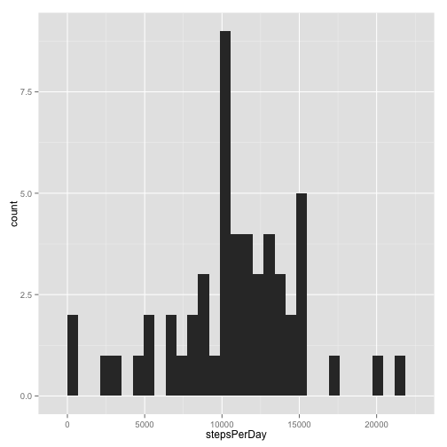
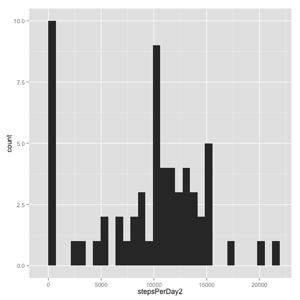
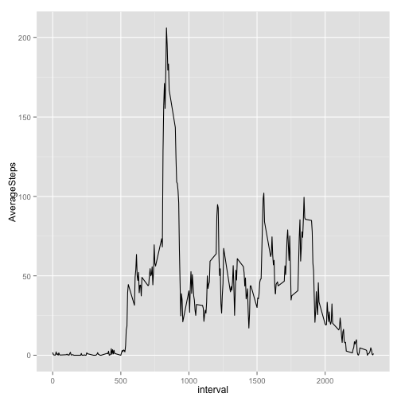
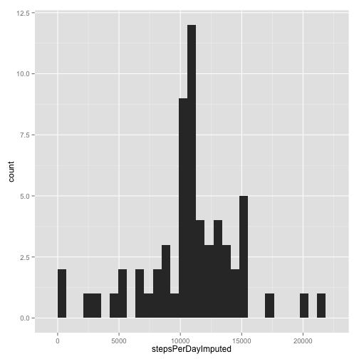
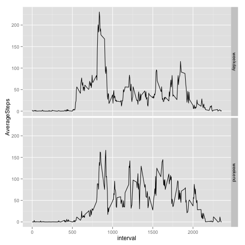

Reproducible Research: Project 1
============================================

## Loading and preprocessing the data
First, read in the data. 

```r
activity <- read.csv(unz('activity.zip','activity.csv'),stringsAsFactors=FALSE)
str(activity)
```

```
## 'data.frame':	17568 obs. of  3 variables:
##  $ steps   : int  NA NA NA NA NA NA NA NA NA NA ...
##  $ date    : chr  "2012-10-01" "2012-10-01" "2012-10-01" "2012-10-01" ...
##  $ interval: int  0 5 10 15 20 25 30 35 40 45 ...
```
  
The date variable is stored as as a character. It should be transformed into a date, for appropriate time series analysis. 

```r
activity$date <- as.Date(activity$date)
```


## What is mean total number of steps taken per day?
We need calculate the total number of steps taken each day, so we'll use `tapply` to split the `activity` data frame and `sum` the total number of steps taken on each day. `tapply` returns a vector, which can be plotted as a histogram.

```r
stepsPerDay <- tapply(activity$steps,activity$date,sum)
library(ggplot2)
qplot(stepsPerDay)
```

```
## stat_bin: binwidth defaulted to range/30. Use 'binwidth = x' to adjust this.
```

 

One problem with this approach is that, with `na.rm=FALSE`, the `sum` function throws an error for any vector that has a missing value. Therefore, we're likely missing a few days when at least one time interval has the amount of steps taken listed as NA. Let's make sure our histogram wouldn't look radically different if we instead excluded the NA's from our sums.

```r
stepsPerDay2 <- tapply(activity$steps,activity$date,sum,na.rm=TRUE)
qplot(stepsPerDay2)
```

```
## stat_bin: binwidth defaulted to range/30. Use 'binwidth = x' to adjust this.
```

 

Basically the same, except we've got a lot more days with no (or almost no) steps. This probably reflects days on which *every* value was missing, so now the sum is just returning 0 on those days.  

OK, now we'll compute the mean and median number of steps taken per day.

```r
mean(stepsPerDay,na.rm=TRUE)
```

```
## [1] 10766.19
```

```r
median(stepsPerDay,na.rm=TRUE)
```

```
## [1] 10765
```

Evidently, the mean is slightly higher than the median, consistent with our right-skewed histogram.


## What is the average daily activity pattern?
We can use `tapply` to calculate the average (over all days) number of steps taken during each time interval. Then, let's build a data frame with two columns - the time interval, and the average number of steps taken in that time interval, when averaging over all days. We can use this frame to create a time-series plot of average steps over the course of a day.

```r
averageStepVector <- tapply(activity$steps,activity$interval,mean,na.rm=TRUE)
averageStepFrame <- as.data.frame(cbind(interval = as.integer(names(averageStepVector)),AverageSteps = averageStepVector))
head(averageStepFrame)
```

```
##    interval AverageSteps
## 0         0    1.7169811
## 5         5    0.3396226
## 10       10    0.1320755
## 15       15    0.1509434
## 20       20    0.0754717
## 25       25    2.0943396
```

```r
qplot(interval,AverageSteps,data=averageStepFrame,geom='line')
```

 

Finally, let's find the interval with the maximum number of steps.


```r
averageStepFrame$interval[which.max(averageStepFrame$AverageSteps)]
```

```
## [1] 835
```
Evidently, at time interval 835 (i.e., between the 835th and 839th minute of the day), is typically when the most steps were taken.


## Imputing missing values

```r
icc <- !complete.cases(activity)
sum(icc)
```

```
## [1] 2304
```
There are 2304 missing data points in our 'activity' frame. 

We're going to impute these missing values by assigning them to be the average number of steps taken at that time interval (over all days). To do that, we'll join the old  `activity` data set with the `averageStepFrame`, so that our new frame - `activityImputed` - has a fourth column corresponding to the mean of the time interval.

```r
library(plyr)
activityImputed <- join(activity,averageStepFrame,by='interval',type='left')
head(activityImputed)
```

```
##   steps       date interval AverageSteps
## 1    NA 2012-10-01        0    1.7169811
## 2    NA 2012-10-01        5    0.3396226
## 3    NA 2012-10-01       10    0.1320755
## 4    NA 2012-10-01       15    0.1509434
## 5    NA 2012-10-01       20    0.0754717
## 6    NA 2012-10-01       25    2.0943396
```
Then, we'll replace all the NAs in the 'interval' column with the value in the new 'AverageSteps' column.

```r
activityImputed$steps[icc] <- activityImputed$AverageSteps[icc]
head(activityImputed)
```

```
##       steps       date interval AverageSteps
## 1 1.7169811 2012-10-01        0    1.7169811
## 2 0.3396226 2012-10-01        5    0.3396226
## 3 0.1320755 2012-10-01       10    0.1320755
## 4 0.1509434 2012-10-01       15    0.1509434
## 5 0.0754717 2012-10-01       20    0.0754717
## 6 2.0943396 2012-10-01       25    2.0943396
```
Now, there are no incomplete cases.

```r
sum(!complete.cases(activityImputed))
```

```
## [1] 0
```

At this point, we can recompute our histogram of steps per day, and the mean and median number of steps taken per day.


```r
stepsPerDayImputed <- tapply(activityImputed$steps,activityImputed$date,sum)
qplot(stepsPerDayImputed)
```

```
## stat_bin: binwidth defaulted to range/30. Use 'binwidth = x' to adjust this.
```

 

```r
mean(stepsPerDayImputed)
```

```
## [1] 10766.19
```

```r
median(stepsPerDayImputed)
```

```
## [1] 10766.19
```
Imputing appears to have a normalizing and smoothing effect on the distribution of steps per day. The mean is unchanged, but the mean and median are now exactly equal to each other. That they are precisely equal is likely to some extent an artifact of the fact that some days had *no* data at all. For these days, the number of steps taken at the every time interval was imputed; consequently, we make the implicit assumption that exactly the average number of steps taken on all days was taken on this day. This means we add to our distribution of steps per day a few extra cases, and in these cases exactly the average number of steps is taken, allowing this exact number to be the median as well as mean.


## Are there differences in activity patterns between weekdays and weekends?
Let's determine whether each data point corresponds to a weekend, or weekday, and bind a new column to our `activityImputed` frame containing a weekday/weekend indicator.


```r
weekend <- ifelse(weekdays(activityImputed$date)=="Saturday" | weekdays(activityImputed$date)=="Sunday","weekend","weekday")
weekend <- factor(weekend,levels=c("weekday","weekend"))
activityImputed <- as.data.frame(cbind(activityImputed,weekend))
head(activityImputed)
```

```
##       steps       date interval AverageSteps weekend
## 1 1.7169811 2012-10-01        0    1.7169811 weekday
## 2 0.3396226 2012-10-01        5    0.3396226 weekday
## 3 0.1320755 2012-10-01       10    0.1320755 weekday
## 4 0.1509434 2012-10-01       15    0.1509434 weekday
## 5 0.0754717 2012-10-01       20    0.0754717 weekday
## 6 2.0943396 2012-10-01       25    2.0943396 weekday
```

Now, we'll `split` our data frame into two frames - one for weekdays, and one for weekends. Then, we'll compute the average number of steps taken at each time interval on weekdays, and on weekends. (To avoid confusion, we're also going to remove the 'AverageSteps' column since we'll be computing a new average for weekdays and weekends seperately.) To easily plot a `facet_grid` with ggplot2, we'll bind our averages into a single data frame with three columns: one for the time interval, a second with the average for that time interval for either a weekday or weekend, and a third with an indicator stating whether that row is for a weekday average or a weekend average.


```r
splitActivityImputed <- split(activityImputed[c(1:3,5)],activityImputed$weekend)
averages <- lapply(splitActivityImputed,function(x) tapply(x$steps,x$interval,mean,na.rm=TRUE))
averageStepFrame2<- data.frame(interval = as.integer(c(names(averages$weekday),names(averages$weekend))),AverageSteps=c(averages$weekday,averages$weekend),weekendorweekday=c(rep("weekday",length(averages$weekday)),rep("weekend",length(averages$weekend))))
head(averageStepFrame2)
```

```
##   interval AverageSteps weekendorweekday
## 1        0   2.25115304          weekday
## 2        5   0.44528302          weekday
## 3       10   0.17316562          weekday
## 4       15   0.19790356          weekday
## 5       20   0.09895178          weekday
## 6       25   1.59035639          weekday
```

```r
p <- ggplot(data=averageStepFrame2,aes(interval,AverageSteps)) + geom_line()
p + facet_grid(weekendorweekday ~ .)
```

 

Acvity patterns are similar on weekdays and weekends. However, on weekends there is not nearly as large a spike in the 800 to 900 interval as there is on weekdays, but there is more activity throughout the rest of the day.
